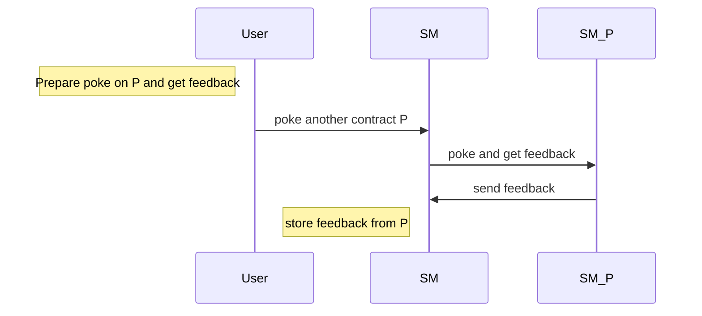
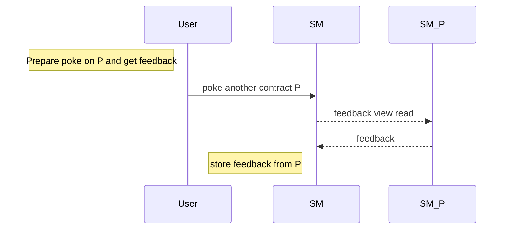

Training dapp n°2
===

# :point_up:  Poke game (enhanced)

Previouly, you learned how to create your first dapp.
In this second session, you will enhance your skills on :
- inter-contract calls
- views
- unit tests

On the first version of the poke game, you were able to poke any deployed contract. Now, you will be able to receive a secret additional feedback if you ask the contract to poke another contract.

## new Poke sequence diagram



# :memo: Prerequisites

There is nothing more than you needed on first session : https://github.com/marigold-dev/training-dapp-1#memo-prerequisites

# :scroll: Smart contract

## Step 1 : Reuse the contract from previous session

https://github.com/marigold-dev/training-dapp-1/blob/main/solution/smartcontract/pokeGame.jsligo

Either you can poke the contract, either you can poke another contract through one and get a feedback.
Change the storage to do so :
- if you poke, you just register the contract's owner address and no feedback
- if you poke and get feedback from another contract, then your register the other contract owner address and its feedback 

```javascript
type pokeMessage = {
    receiver : address,
    feedback : string
};

type storage = {
    pokeTraces : map<address, pokeMessage>,
    feedback : string
};
```

Your poke function has changed

```javascript
let poke = (store : storage) : return_ => {
    let feedbackMessage = {receiver : Tezos.self_address ,feedback: ""};
    return [  list([]) as list<operation>, {...store, 
        pokeTraces : Map.add(Tezos.source, feedbackMessage, store.pokeTraces) }]; 
};
```

`...store` do a copy by value of your object structure
Here is the explanation of the syntax of [Functional updates](https://ligolang.org/docs/language-basics/maps-records/#functional-updates)

For more information about [Map](https://ligolang.org/docs/language-basics/maps-records/#maps)

It is not really needed to do a `Record`, but we wanted to introduce [object structure manipulation](https://ligolang.org/docs/language-basics/maps-records#records)  

`Tezos.self_address` is a native function that return the currently running contract address. Have a look on [Tezos native functions](https://ligolang.org/docs/reference/current-reference) 

Then compile your contract

```bash
ligo compile contract pokeGame.jsligo
```

We will write the pokeAndGetFeedback function later, let pass to unit testing

## Step 2 : Write unit tests

On the smartcontract repository , create a new file 

```bash
touch unit_pokeGame.jsligo
```


> :information_source: Testing documentation can be found [here](https://ligolang.org/docs/advanced/testing)
> :information_source: Test module with specific functions [here](https://ligolang.org/docs/reference/test)


Edit the file

```javascript
#include "./pokeGame.jsligo"

// reset state
let _ = Test.reset_state ( 2 as nat, list([]) as list <tez> );
let faucet = Test.nth_bootstrap_account(0);
let sender1 : address = Test.nth_bootstrap_account(1);
let _ = Test.log("Sender 1 has balance : ");
let _ = Test.log(Test.get_balance(sender1));

let _ = Test.set_baker(faucet);
let _ = Test.set_source(faucet);

//contract origination
let [taddr, _, _] = Test.originate(main, {pokeTraces : Map.empty as map<address, pokeMessage> , feedback : "kiss"}, 0 as tez);
let contr = Test.to_contract(taddr);
let contrAddress = Tezos.address(contr);
let _ = Test.log("contract deployed with values : ");
let _ = Test.log(contr);

//functions
let _testPoke = (s : address) : bool => {
    Test.set_source(s);

    let status = Test.transfer_to_contract(contr, Poke(), 0 as tez);
    Test.log(status);
    
    let store : storage = Test.get_storage(taddr);
    Test.log(store);

    //check poke is registered
    match(Map.find_opt (s, store.pokeTraces), {
        Some: (pokeMessage: pokeMessage) => { assert_with_error(pokeMessage.feedback == "","feedback "+pokeMessage.feedback+" is not equal to expected "+"(empty)"); assert_with_error(pokeMessage.receiver == contrAddress,"receiver is not equal"); return true; } ,
        None: () => false
       });
      
  };
  
 
  //********** TESTS *************/
 
  let testSender1Poke = _testPoke(sender1);
```

Explanations : 
- `#include "./pokeGame.jsligo"`  to include the source file in order to call functions and use object definitions
- `Test.reset_state ( 2...` this creates two implicit accounts on the test environment
- `Test.nth_bootstrap_account` this return the nth account from the environment
- `Test.originate(MAIN_FUNCTION, INIT_STORAGE, INIT_BALANCE)` will originate a smart contract into the environment
- `Test.to_contract(taddr)` and `Tezos.address(contr)` are util functions to convert typed addresses, contract and contract addresses
- `let _testPoke = (s : address) : bool => {...}` declaring function starting with "**_**" will not be part of the test run results. Use this to factorize tests changing only the parameters of the function for different scenarios
- `Test.set_source` do not forget to set this value for the transaction signer
- `Test.transfer_to_contract(CONTRACT, PARAMS, TEZ_COST)` This is how we call a transaction
- `Test.get_storage` this is how to retrieve the contract's storage
- `assert_with_error(CONDITION,MESSAGE)` Use assertion for unit testing
- `let testSender1Poke = _testPoke(sender1);` This test function will be part of the execution run results

> See more details on the documentation here : https://ligolang.org/docs/reference/test

Run the test 

```bash
ligo run test unit_pokeGame.jsligo 
```

Output should give you intermediary logs and finally the test results 
```logs
"Sender 1 has balance : "
...
Everything at the top-level was executed.
- testSender1Poke exited with value true.
```


## Step 3 : do an inter contract call

To simplify, we are deploying 2 versions of the same smartcontract to simulate inter-contract call and get the feedback message (cf. [sequence diagram](#new-poke-sequence-diagram))

We will create a new poke function `PokeAndGetFeedback: (other : address)` that will have a second part function `PokeAndGetFeedbackCallback: (feedback : returned_feedback)` as callback.

Then the function to call on the second contract is `GetFeedback: (contract_callback: oracle_param)`. 

> Very often, the second contract is named `oracle` because genrally its storage is updated by offchain scheduler and other onchain contract are fetching information from it

Edit the file pokeGame.jsligo, starting with the main function

```javascript
...

type returned_feedback = [address, string]; //address that gives feedback and a string message

type oracle_param = contract<returned_feedback>;

type parameter =
| ["Poke"]
| ["PokeAndGetFeedback", address]
| ["PokeAndGetFeedbackCallback", returned_feedback]
| ["GetFeedback",oracle_param];

...

let main = ([action, store] : [parameter, storage]) : return_ => {
    return match (action, {
        Poke: () => poke(store),
        PokeAndGetFeedback: (other : address) => pokeAndGetFeedback(other,store),
        PokeAndGetFeedbackCallback: (feedback : returned_feedback) => pokeAndGetFeedbackCallback(feedback,store),
        GetFeedback: (contract_callback: oracle_param)=> getFeedback(contract_callback,store)
    } 
    )
};
```

Explanations : 
- `type returned_feedback = [address, string]` the parameters of an oracle function always start with the address of the contract caller and followed by the return objects
- `type oracle_param = contract<returned_feedback>` the oracle parameters need to be wrapped inside a typed contract 

We need to write the missing functions, starting with `getFeedback`

Add this new function (before the main method)
```javascript
let getFeedback = ([contract_callback,store] : [contract<returned_feedback>,storage]): return_ => {
    let op : operation = Tezos.transaction(
            [Tezos.self_address,store.feedback], 
            (0 as mutez),
            contract_callback);   
    return [list([op]) ,store];
};
```

- `([param1,param2] : [param1Type,param2Type])` actually jsligo is not able to use the several parameters definition in a row like this `(param1 : param1Type ,param2 : param2Type)`, you will require to use pairs as above
- `Tezos.transaction(RETURNED_PARAMS,TEZ_COST,CALLBACK_CONTRACT)` the oracle function requires to return the value back to the contract caller that is passed already as first parameter
- `return [list([op]) ,store]` this time, you return a list of operations to execute, there is no need to update the contract storage (but it is a mandatory return object)

Add now, the first part of the function `pokeAndGetFeedback` 

```javascript
let pokeAndGetFeedback = ([oracleAddress,store]:[address,storage]) : return_ => {
    
  //Prepares call to oracle
  let call_to_oracle = () : contract<oracle_param> => { 
    return match(Tezos.get_entrypoint_opt("%getFeedback",oracleAddress) as option<contract<oracle_param>>,{ 
      None : () => failwith("NO_ORACLE_FOUND"),
      Some : (contract : contract<oracle_param>) => contract
    });
  };
  
  // Builds transaction
  let op: operation = Tezos.transaction(
    ((Tezos.self("%pokeAndGetFeedbackCallback") as contract<returned_feedback>)),
    (0 as mutez),
    call_to_oracle());
    
    return [  list([op])  , store];
};
```

- `Tezos.get_entrypoint_opt("%getFeedback",oracleAddress)` you require to get the oracle contract address. Then you want to call a specific entrypoint of this contract. The function name will be always starting with `%` with always the first letter in lowercase (even if the code is different)
- `Tezos.transaction(((Tezos.self("%pokeAndGetFeedbackCallback") as contract<returned_feedback>)),TEZ_COST,call_to_oracle())` The transaction takes as first param the entrypoint of for the callback that the oracle will use to answer the feedback, the tez cost and the oracle contract you got just above as transaction destination

Let's write the last missing function `pokeAndGetFeedbackCallback` that will receive the feedback and finally store it

```javascript
let pokeAndGetFeedbackCallback = ([feedback,store] : [returned_feedback , storage]) : return_ => {
    let feedbackMessage = {receiver : feedback[0] ,feedback: feedback[1]};
    return [  list([]) as list<operation>, {...store, 
        pokeTraces : Map.add(Tezos.source, feedbackMessage , store.pokeTraces) }]; 
};
```

- `let feedbackMessage = {receiver : feedback[0] ,feedback: feedback[1]}` prepares the trace including the feedback message and the feedback contract creator
- `{...store,pokeTraces : Map.add(Tezos.source, feedbackMessage , store.pokeTraces) }` add the new trace to the global trace map 


Just compile the contract. Check if it passes correctly
```bash 
ligo compile contract pokeGame.jsligo  
```

(Optional) Write a unit test for this new function `pokeAndGetFeedback`

## Step 4 : Use views instead of inter-contract call

As you did on previous step, inter-contract calls can complexify a lot the business logic but not only, think about the cost : https://ligolang.org/docs/tutorials/inter-contract-calls/inter-contract-calls#a-note-on-complexity

In our case, the oracle is providing a read only storage that can be replaced by a `view` instead of complex and costy callbacks

> See documentation here : https://ligolang.org/docs/protocol/hangzhou#on-chain-views



Comment previous functions `pokeAndGetFeedbackCallback` and `getFeedback`, also on `parameter` variant declaration and in the `match` of `main` function 

Edit function `pokeAndGetFeedback` to do a read view operation instead of a transaction call

```javascript
let pokeAndGetFeedback = ([oracleAddress,store]:[address,storage]) : return_ => {
  //Read the feedback view
  let feedbackOpt : option<string> = Tezos.call_view("feedback", unit, oracleAddress);

  match( feedbackOpt , {
    Some : (feedback : string) => {
        let feedbackMessage = {receiver : oracleAddress ,feedback: feedback};
        return [  list([]) as list<operation>, {...store, 
          pokeTraces : Map.add(Tezos.source, feedbackMessage , store.pokeTraces) }]; 
        }, 
    None : () => failwith("Cannot find view feedback on given oracle address")
  });
};
```

Declare the view at the end of the file. Do not forget the annotation @view in comments

```javascript
// @view
let feedback = ([_, store] : [unit, storage]) : string => { return store.feedback };
```

Just compile the contract. Check if it passes correctly
```bash 
ligo compile contract pokeGame.jsligo  
```

(Optional) Write a unit test for the updated function `pokeAndGetFeedback`

# :construction_worker:  Dapp 

## Step 1 : Reuse dapp from previous session

https://github.com/marigold-dev/training-dapp-1/tree/main/solution/dapp

## Step 2 : Redeploy new smart contract code

Redeploy a new version of the smart contract (force it if necessary with --force). You can set `feedback` value to any action other than `kiss` :kissing:

```bash
ligo compile contract ./smartcontract/pokeGame.jsligo --output-file pokeGame.tz

ligo compile storage ./smartcontract/pokeGame.jsligo '{pokeTraces : Map.empty as map<address, pokeMessage> , feedback : "kiss"}' --output-file pokeGameStorage.tz --entry-point main

tezos-client originate contract mycontract transferring 0 from <ACCOUNT_KEY_NAME> running pokeGame.tz --init "$(cat pokeGameStorage.tz)" --burn-cap 1 --force
```

## Step 3 : Adapt the application code

Keep the contract address to update the file dapp/src/App.tsx

```javascript
      setContracts((await contractsService.getSimilar({address:"KT1LqjJvz82zGqB7ExxCpCdjycKVjrsDFV4d" , includeStorage:true, sort:{desc:"id"}})));
```

Add new type at beginning of the file
```javascript
type pokeMessage = {
  receiver : string,
  feedback : string
};
```

Add new React variable after `userBalance` definition

```javascript
  const [contractToPoke, setContractToPoke] = useState<string>("");
```

then change the poke function to set entrypoint to `pokeAndGetFeedback`

```javascript
 //poke
  const poke = async (e :  React.FormEvent<HTMLFormElement>, contract : Contract) => {  
    e.preventDefault(); 
    let c : WalletContract = await Tezos.wallet.at(""+contract.address);
    try {
      const op = await c.methods.pokeAndGetFeedback(contractToPoke).send();
      await op.confirmation();
      console.log("Tx done");
    } catch (error : any) {
      console.log(error);
      console.table(`Error: ${JSON.stringify(error, null, 2)}`);
    }
  };
```

Finally, change the display of the table

```html
<table><thead><tr><th>address</th><th>trace "contract - feedback - user"</th><th>action</th></tr></thead><tbody>
    {contracts.map((contract) => <tr><td style={{borderStyle: "dotted"}}>{contract.address}</td><td style={{borderStyle: "dotted"}}>{(contract.storage !== null && contract.storage.pokeTraces !== null && Object.entries(contract.storage.pokeTraces).length > 0)?Object.keys(contract.storage.pokeTraces).map((k : string)=>contract.storage.pokeTraces[k].receiver+" "+contract.storage.pokeTraces[k].feedback+" "+k+","):""}</td><td style={{borderStyle: "dotted"}}><form onSubmit={(e) =>poke(e,contract)}><input type="text" onChange={e=>setContractToPoke(e.currentTarget.value)} placeholder='enter contract address here' /><button  type='submit'>Poke</button></form></td></tr>)}
    </tbody></table>
```

Relaunch the app

```bash
cd dapp
yarn run start
```

On the listed contract, choose your line and input the address of the contract you will receive a feedback. Click on `poke`


This time, the logged user will receive a feedback from a targeted contract (as input of the form) via any listed contract (the first column of the table).

:point_up: Poke other developer's contract to discover their contract hidden feedback when you poke them


# :palm_tree: Conclusion :sun_with_face:

Now, you are able to call other contracts, use views and test you smart contract before deploying it

On next training, you will learn how to upgrade a Smart contract, store and execute lambda function and use tickets

[:arrow_right: NEXT](https://github.com/marigold-dev/training-dapp-3)