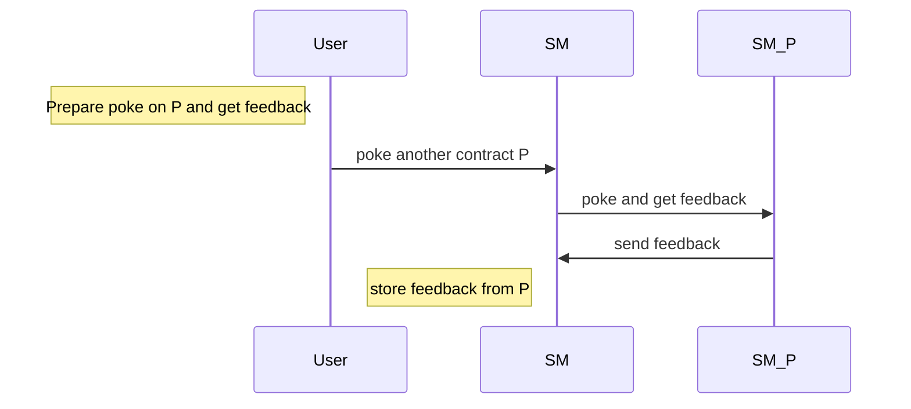

Training dapp n°2
===

# :point_up:  Poke game (enhanced)

Previouly, you learned how to create your first dapp.
In this second session, you will enhance your skills on :
- inter-contract calls
- views
- unit tests

On the first version of the poke game, you were able to poke any deployed contract. Now, you will be able to receive a secret additional feedback if you ask the contract to poke another contract.

Here is the new Poke sequence diagram

