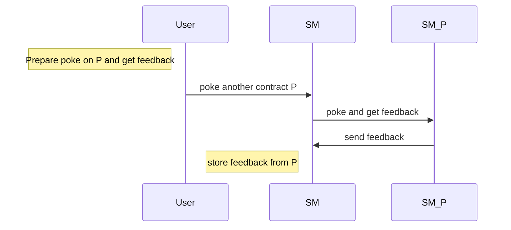

Training dapp n°2
===

# :point_up:  Poke game (enhanced)

Previouly, you learned how to create your first dapp.
In this second session, you will enhance your skills on :
- inter-contract calls
- views
- unit tests

On the first version of the poke game, you were able to poke any deployed contract. Now, you will be able to receive a secret additional feedback if you ask the contract to poke another contract.

Here is the new Poke sequence diagram



# :memo: Prerequisites

There is nothing more than you neededon first session : https://github.com/marigold-dev/training-dapp-1#memo-prerequisites

# :scroll: Smart contract

## Step 1 : Reuse the contract from previous session

https://github.com/marigold-dev/training-dapp-1/blob/main/solution/smartcontract/pokeGame.jsligo

Either you can poke the contract, either you can poke another contract through one and get a feedback.
Change the storage to do so :
- if you poke, you just register the contract's owner address and no feedback
- if you poke and get feedback from another contract, then your register the other contract owner address and its feedback 

```javascript
type pokeMessage = {
    receiver : address,
    feedback : string
};

type storage = {
    pokeTraces : map<address, pokeMessage>
};
```

Your poke function has changed

```javascript
let poke = (store : storage) : return_ => {
    let feedbackMessage = {receiver : Tezos.self_address ,feedback: ""};
    return [  list([]) as list<operation>, {...store, 
        pokeTraces : Map.add(Tezos.source, feedbackMessage, store.pokeTraces) }]; 
};
```

`...store` do a copy by value of your object structure
Here is the explanation of the syntax of [Functional updates](https://ligolang.org/docs/language-basics/maps-records/#functional-updates)

For more information about [Map](https://ligolang.org/docs/language-basics/maps-records/#maps)

It is not really needed to do a `Record`, but we wanted to introduce [object structure manipulation](https://ligolang.org/docs/language-basics/maps-records#records)  

`Tezos.self_address` is a native function that return the currently running contract address. Have a look on [Tezos native functions](https://ligolang.org/docs/reference/current-reference) 

Then compile your contract

```bash
ligo compile contract pokeGame.jsligo
```

We will write the pokeAndGetFeedback function later, let pass to unit testing

## Step 2 : Write unit tests

On the smartcontract repository , create a new file 

```bash
touch unit_pokeGame.jsligo
```


> :information_source: Testing documentation can be found [here](https://ligolang.org/docs/advanced/testing)
> :information_source: Test module with specific functions [here](https://ligolang.org/docs/reference/test)


Edit the file

```javascript


```

## Step 3 : do an inter contract call

## Step 4 : Use views instead of inter-contract call

# :construction_worker:  Dapp 

## Step 1 : Reuse dapp from previous session

https://github.com/marigold-dev/training-dapp-1/tree/main/solution/dapp

## Step 2 : Adapt the application code


# :palm_tree: Conclusion :sun_with_face:

Now, you are able to call other contracts, use views and test you smart contract before deploying it

On next training, you will learn how to upgrade a Smart contract, store and execute lambda function and use the Global table of constants

[:arrow_right: NEXT](https://github.com/marigold-dev/training-dapp-3)