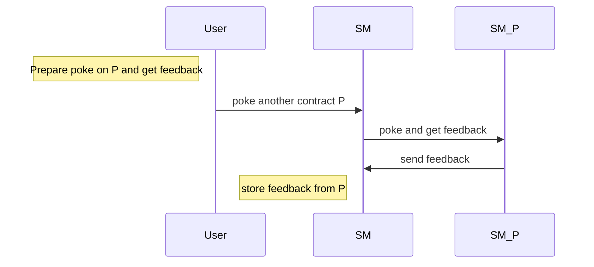

Training dapp n°2
===

# :point_up:  Poke game (enhanced)

Previouly, you learned how to create your first dapp.
In this second session, you will enhance your skills on :
- inter-contract calls
- views
- unit tests

On the first version of the poke game, you were able to poke any deployed contract. Now, you will be able to receive a secret additional feedback if you ask the contract to poke another contract.

Here is the new Poke sequence diagram



# :memo: Prerequisites

There is nothing more than you neededon first session : https://github.com/marigold-dev/training-dapp-1#memo-prerequisites

# :scroll: Smart contract

## Step 1 : Reuse the contract from previous session

https://github.com/marigold-dev/training-dapp-1/blob/main/solution/smartcontract/pokeGame.jsligo

Either you can poke the contract, either you can poke another contract through one and get a feedback.
Change the storage to do so :
- if you poke, you just register the contract's owner address and no feedback
- if you poke and get feedback from another contract, then your register the other contract owner address and its feedback 

```javascript
type pokeMessage = {
    receiver : address,
    feedback : string
};

type storage = {
    pokeTraces : map<address, pokeMessage>
};
```

Your poke function has changed

```javascript
let poke = (store : storage) : return_ => {
    let feedbackMessage = {receiver : Tezos.self_address ,feedback: ""};
    return [  list([]) as list<operation>, {...store, 
        pokeTraces : Map.add(Tezos.source, feedbackMessage, store.pokeTraces) }]; 
};
```

`...store` do a copy by value of your object structure
Here is the explanation of the syntax of [Functional updates](https://ligolang.org/docs/language-basics/maps-records/#functional-updates)

For more information about [Map](https://ligolang.org/docs/language-basics/maps-records/#maps)

It is not really needed to do a `Record`, but we wanted to introduce [object structure manipulation](https://ligolang.org/docs/language-basics/maps-records#records)  

`Tezos.self_address` is a native function that return the currently running contract address. Have a look on [Tezos native functions](https://ligolang.org/docs/reference/current-reference) 

Then compile your contract

```bash
ligo compile contract pokeGame.jsligo
```

We will write the pokeAndGetFeedback function later, let pass to unit testing

## Step 2 : Write unit tests

On the smartcontract repository , create a new file 

```bash
touch unit_pokeGame.jsligo
```


> :information_source: Testing documentation can be found [here](https://ligolang.org/docs/advanced/testing)
> :information_source: Test module with specific functions [here](https://ligolang.org/docs/reference/test)


Edit the file

```javascript
#include "./pokeGame.jsligo"

// reset state
let _ = Test.reset_state ( 2 as nat, list([]) as list <tez> );
let faucet = Test.nth_bootstrap_account(0);
let sender1 : address = Test.nth_bootstrap_account(1);
let _ = Test.log("Sender 1 has balance : ");
let _ = Test.log(Test.get_balance(sender1));

let _ = Test.set_baker(faucet);
let _ = Test.set_source(faucet);

//contract origination
let [taddr, _, _] = Test.originate(main, {pokeTraces : Map.empty as map<address, pokeMessage>}, 0 as tez);
let contr = Test.to_contract(taddr);
let contrAddress = Tezos.address(contr);
let _ = Test.log("contract deployed with values : ");
let _ = Test.log(contr);

//functions
let _testPoke = (s : address) : bool => {
    Test.set_source(s);

    let status = Test.transfer_to_contract(contr, Poke(), 0 as tez);
    Test.log(status);
    
    let store : storage = Test.get_storage(taddr);
    Test.log(store);

    //check poke is registered
    match(Map.find_opt (s, store.pokeTraces), {
        Some: (pokeMessage: pokeMessage) => { assert_with_error(pokeMessage.feedback == "","feedback "+pokeMessage.feedback+" is not equal to expected "+"(empty)"); assert_with_error(pokeMessage.receiver == contrAddress,"receiver is not equal"); return true; } ,
        None: () => false
       });
      
  };
  
 
  //********** TESTS *************/
 
  let testSender1Poke = _testPoke(sender1);
```

Explanations : 
- `#include "./pokeGame.jsligo"`  to include the source file in order to call functions and use object definitions
- `Test.reset_state ( 2...` this creates two implicit accounts pn the test environment
- `Test.nth_bootstrap_account` this return the nth account from the environment
- `Test.originate(MAIN_FUNCTION, INIT_STORAGE, INIT_BALANCE)` will originate a smart contract into the environment
- `Test.to_contract(taddr)` and `Tezos.address(contr)` are util functions to convert typed addresses, contract and contract addresses
- `let _testPoke = (s : address) : bool => {...}` declaring function starting with "**_**" will not be part of the test run results. Use this to factorize tests changing only the parameters of the function for different scenarios
- `Test.set_source` do not forget to set this value for the transaction signer
- `Test.transfer_to_contract(CONTRACT, PARAMS, TEZ_COST)` This is how we call a transaction
- `Test.get_storage` this is how to retrieve the contract's storage
- `assert_with_error(CONDITION,MESSAGE)` Use assertion for unit testing
- `let testSender1Poke = _testPoke(sender1);` This test function will be part of the execution run results

> See more details on the documentation here : https://ligolang.org/docs/reference/test

Run the test 

```bash
ligo run test unit_pokeGame.jsligo 
```

Output should give you intermediary logs and finally the test results 
```logs
"Sender 1 has balance : "
...
Everything at the top-level was executed.
- testSender1Poke exited with value true.
```


## Step 3 : do an inter contract call

## Step 4 : Use views instead of inter-contract call

# :construction_worker:  Dapp 

## Step 1 : Reuse dapp from previous session

https://github.com/marigold-dev/training-dapp-1/tree/main/solution/dapp

## Step 2 : Adapt the application code


# :palm_tree: Conclusion :sun_with_face:

Now, you are able to call other contracts, use views and test you smart contract before deploying it

On next training, you will learn how to upgrade a Smart contract, store and execute lambda function and use the Global table of constants

[:arrow_right: NEXT](https://github.com/marigold-dev/training-dapp-3)