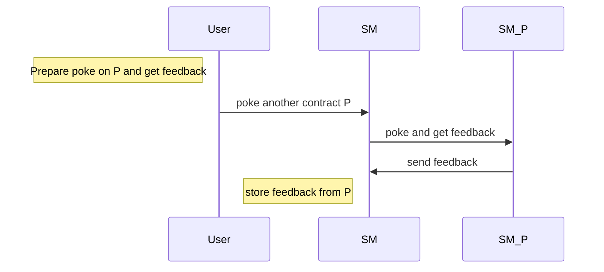
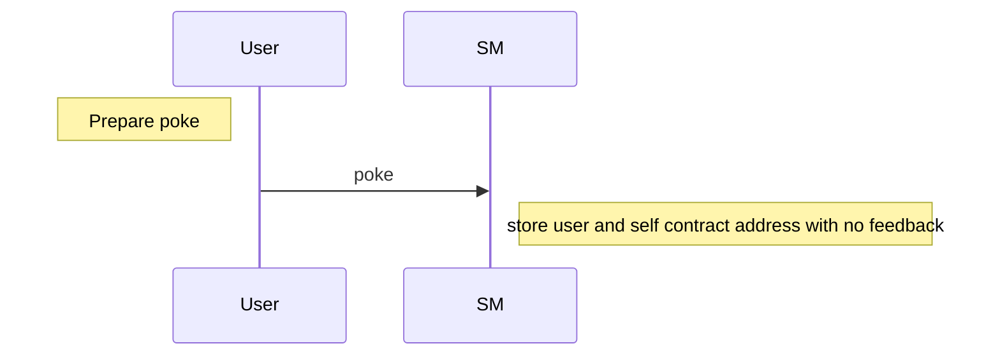
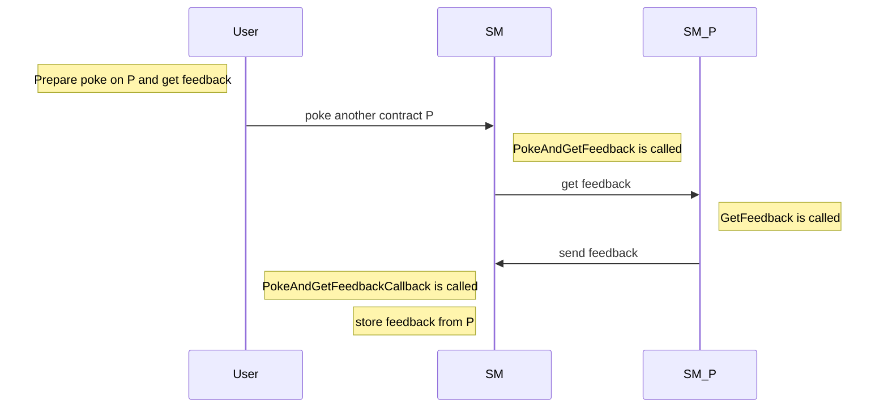
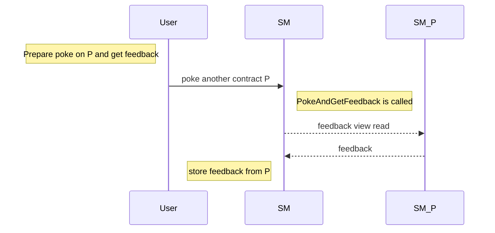
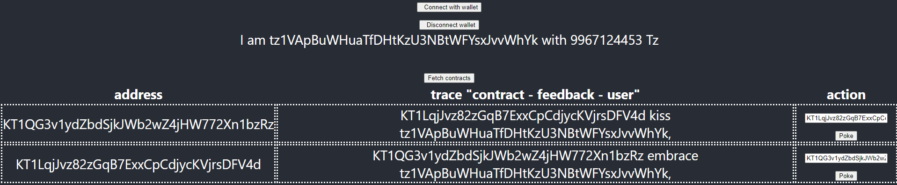

## :round_pushpin: [See Github version and full code here](https://github.com/marigold-dev/training-dapp-2)

# Training dapp n°2

# :point_up: Poke game (enhanced)

Previously, you learned how to create your first dapp.
In this second session, you will enhance your skills on :

- inter-contract calls
- views
- unit & mutation tests

On the first version of the poke game, you were able to poke any deployed contract. Now, you will be able to receive a secret additional feedback if you ask the contract to poke another contract.

## new Poke sequence diagram



# :memo: Prerequisites

There is nothing more than you needed on first session : https://github.com/marigold-dev/training-dapp-1#memo-prerequisites

# :scroll: Smart contract

## Step 1 : Reuse the project from previous session

Start from previous project : https://github.com/marigold-dev/training-dapp-1/blob/main/solution

Reuse the previous smart contract : https://github.com/marigold-dev/training-dapp-1/blob/main/solution/contracts/pokeGame.jsligo

Note : To get libraries ready (if you start from fresh project clone), run :

```bash
npm i && cd app && yarn install
```

Either you can poke the contract, either you can poke another contract through one and get a feedback.
Change the storage to do so :

- if you poke, you just register the contract's owner address and no feedback
- if you poke and get feedback from another contract, then your register the other contract owner address and its feedback

Edit `pokeGame.jsligo` and replace storage definition by this one :

```ligolang
type pokeMessage = {
    receiver : address,
    feedback : string
};

type storage = {
    pokeTraces : map<address, pokeMessage>,
    feedback : string
};
```

Your poke function has changed to

```ligolang
@entry
const poke = (_ : parameter, store : storage) : return_ => {
    let feedbackMessage = {receiver : Tezos.get_self_address() ,feedback: ""};
    return [  list([]) as list<operation>, {...store,
        pokeTraces : Map.add(Tezos.get_source(), feedbackMessage, store.pokeTraces) }];
};
```

`...store` do a copy by value of your object structure
Here is the explanation of the syntax of [Functional updates](https://ligolang.org/docs/language-basics/maps-records/#functional-updates)

> Note : you cannot do assignment like this `store.pokeTraces=...` in jsligo , use `Functional updates` instead

For more information about [Map](https://ligolang.org/docs/language-basics/maps-records/#maps)

It is not really needed to do a `Record`, but we wanted to introduce [object structure manipulation](https://ligolang.org/docs/language-basics/maps-records#records)

`Tezos.get_self_address` is a native function that return the currently running contract address. Have a look on [Tezos native functions](https://ligolang.org/docs/reference/current-reference)

Edit `pokeGame.storageList.jsligo` to change the storage initialization

```ligolang
#include "pokeGame.jsligo"
const default_storage = {
    pokeTraces : Map.empty as map<address, pokeMessage>,
    feedback : "kiss"
};
```

Then compile your contract

```bash
TAQ_LIGO_IMAGE=ligolang/ligo:0.71.0 taq compile pokeGame.jsligo
```

We will write the pokeAndGetFeedback function later, let's do unit testing first !

## Step 2 : Write unit tests

We will test only the poke function for now



Add a new unit test smart contract file `unit_pokeGame.jsligo`

```bash
taq create contract unit_pokeGame.jsligo
```

> :information_source: Testing documentation can be found [here](https://ligolang.org/docs/advanced/testing)
> :information_source: Test module with specific functions [here](https://ligolang.org/docs/reference/test)

Edit the file

```ligolang
#import "./pokeGame.jsligo" "PokeGame"

export type main_fn = module_contract<parameter_of PokeGame, PokeGame.storage>;

// reset state
const _ = Test.reset_state ( 2 as nat, list([]) as list <tez> );
const faucet = Test.nth_bootstrap_account(0);
const sender1 : address = Test.nth_bootstrap_account(1);
const _ = Test.log("Sender 1 has balance : ");
const _ = Test.log(Test.get_balance(sender1));

const _ = Test.set_baker(faucet);
const _ = Test.set_source(faucet);

const initial_storage = {pokeTraces : Map.empty as map<address, PokeGame.pokeMessage> , feedback : "kiss"};
const initial_tez = 0 as tez;

//functions
export const _testPoke = (taddr : typed_address<parameter_of PokeGame, PokeGame.storage>, s: address) : unit => {

    //contract origination
    //const [taddr, _, _] = Test.originate_module(contract_of(PokeGame),  {pokeTraces : Map.empty as map<address, PokeGame.pokeMessage> , feedback : "kiss"}, 0 as tez);
    const contr = Test.to_contract(taddr);
    const contrAddress = Tezos.address(contr);
    const _ = Test.log("contract deployed with values : ");
    const _ = Test.log(contr);

    Test.set_source(s);

    const status = Test.transfer_to_contract(contr, Poke(), 0 as tez);
    Test.log(status);

    const store : PokeGame.storage = Test.get_storage(taddr);
    Test.log(store);

    //check poke is registered
    match(Map.find_opt (s, store.pokeTraces), {
        Some: (pokeMessage: PokeGame.pokeMessage) => { assert_with_error(pokeMessage.feedback == "","feedback "+pokeMessage.feedback+" is not equal to expected "+"(empty)"); assert_with_error(pokeMessage.receiver == contrAddress,"receiver is not equal");} ,
        None: () => assert_with_error(false,"don't find traces")
       });

  };


  //********** TESTS *************/

const testSender1Poke = (() : unit => {
  const [taddr, _, _] = Test.originate_module(contract_of(PokeGame), initial_storage, initial_tez);
  _testPoke(taddr, sender1);
})();
```

Explanations :

- `#import "./pokeGame.jsligo" "CONTRACT"` to import the source file as module in order to call functions and use object definitions
- `export type main_fn` it will be useful later for the mutation tests to know the real typings of our main function
- `Test.reset_state ( 2...` this creates two implicit accounts on the test environment
- `Test.nth_bootstrap_account` this return the nth account from the environment
- `Test.to_contract(taddr)` and `Tezos.address(contr)` are util functions to convert typed addresses, contract and contract addresses
- `let _testPoke = (s : address) : unit => {...}` declaring function starting with `_` will not be part of the test run results. Use this to factorize tests changing only the parameters of the function for different scenarios
- `Test.set_source` do not forget to set this value for the transaction signer
- `Test.transfer_to_contract(CONTRACT, PARAMS, TEZ_COST)` This is how we call a transaction
- `Test.get_storage` this is how to retrieve the contract's storage
- `assert_with_error(CONDITION,MESSAGE)` Use assertion for unit testing
- `const testSender1Poke = ...` This test function will be part of the execution run results
- `Test.originate_module(MODULE_CONVERTED_TO_CONTRACT,INIT_STORAGE, INIT_BALANCE)` will originate a smart contract into the environment. Here we specify that the module to convert to a smart contract

> See more details on the documentation here : https://ligolang.org/docs/reference/test

Run the test

```bash
TAQ_LIGO_IMAGE=ligolang/ligo:0.73.0 taq test unit_pokeGame.jsligo
```

Output should give you intermediary logs and finally the test results

```logs
┌──────────────────────┬────────────────────────────────────────────────────────────────────────────────────────────────────────────────────────────────────────────────┐
│ Contract             │ Test Results                                                                                                                                   │
├──────────────────────┼────────────────────────────────────────────────────────────────────────────────────────────────────────────────────────────────────────────────┤
│ unit_pokeGame.jsligo │ "Sender 1 has balance : "                                                                                                                      │
│                      │ 3800000000000mutez                                                                                                                             │
│                      │ "contract deployed with values : "                                                                                                             │
│                      │ KT1KwMWUjU6jYyLCTWpZAtT634Vai7paUnRN(None)                                                                                                     │
│                      │ Success (2130n)                                                                                                                                │
│                      │ {feedback = "kiss" ; pokeTraces = [tz1TDZG4vFoA2xutZMYauUnS4HVucnAGQSpZ -> {feedback = "" ; receiver = KT1KwMWUjU6jYyLCTWpZAtT634Vai7paUnRN}]} │
│                      │ Everything at the top-level was executed.                                                                                                      │
│                      │ - testSender1Poke exited with value ().                                                                                                        │
│                      │                                                                                                                                                │
│                      │ 🎉 All tests passed 🎉                                                                                                                         │
└──────────────────────┴────────────────────────────────────────────────────────────────────────────────────────────────────────────────────────────────────────────────┘
```

## Step 3 : do an inter contract call



To simplify, we are deploying 2 versions of the same smartcontract to simulate inter-contract call and get the feedback message (cf. [sequence diagram](#new-poke-sequence-diagram))

We will create a new poke function `PokeAndGetFeedback: (other : address)` that will have a second part function `PokeAndGetFeedbackCallback: (feedback : returned_feedback)` as callback.

Then the function to call on the second contract is `GetFeedback: (contract_callback: oracle_param)`.

> Very often, the second contract is named `oracle` because genrally its storage is updated by offchain scheduler and other onchain contract are fetching information from it

Edit the file `pokeGame.jsligo`, starting with the main function and some types to (re)define :

```ligolang
type returned_feedback = [address, string]; //address that gives feedback and a string message

type oracle_param = contract<returned_feedback>;
```

Explanations :

- `type returned_feedback = [address, string]` the parameters of an oracle function always start with the address of the contract caller and followed by the return objects
- `type oracle_param = contract<returned_feedback>` the oracle parameters need to be wrapped inside a typed contract

We need to write the missing functions, starting with `getFeedback`

Add this new function at the end of the file

```ligolang
@entry
const getFeedback = (contract_callback : contract<returned_feedback>, store : storage): return_ => {
    let op : operation = Tezos.transaction(
            [Tezos.get_self_address(),store.feedback],
            (0 as mutez),
            contract_callback);
    return [list([op]) ,store];
};
```

- `Tezos.transaction(RETURNED_PARAMS,TEZ_COST,CALLBACK_CONTRACT)` the oracle function requires to return the value back to the contract caller that is passed already as first parameter
- `return [list([op]) ,store]` this time, you return a list of operations to execute, there is no need to update the contract storage (but it is a mandatory return object)

Add now, the first part of the function `pokeAndGetFeedback`

```ligolang
@entry
const pokeAndGetFeedback = (oracleAddress : address, store : storage) : return_ => {

  //Prepares call to oracle
  let call_to_oracle = () : contract<oracle_param> => {
    return match(Tezos.get_entrypoint_opt("%getFeedback",oracleAddress) as option<contract<oracle_param>>,{
      None : () => failwith("NO_ORACLE_FOUND"),
      Some : (contract : contract<oracle_param>) => contract
    });
  };

  // Builds transaction
  let op: operation = Tezos.transaction(
    ((Tezos.self("%pokeAndGetFeedbackCallback") as contract<returned_feedback>)),
    (0 as mutez),
    call_to_oracle());

    return [  list([op])  , store];
};
```

- `Tezos.get_entrypoint_opt("%getFeedback",oracleAddress)` you require to get the oracle contract address. Then you want to call a specific entrypoint of this contract. The function name will be always starting with `%` with always the first letter in lowercase (even if the code is different)
- `Tezos.transaction(((Tezos.self("%pokeAndGetFeedbackCallback") as contract<returned_feedback>)),TEZ_COST,call_to_oracle())` The transaction takes as first param the entrypoint of for the callback that the oracle will use to answer the feedback, the tez cost and the oracle contract you got just above as transaction destination

Let's write the last missing function `pokeAndGetFeedbackCallback` that will receive the feedback and finally store it

```ligolang
@entry
const pokeAndGetFeedbackCallback = (feedback : returned_feedback, store : storage) : return_ => {
    let feedbackMessage = {receiver : feedback[0] ,feedback: feedback[1]};
    return [  list([]) as list<operation>, {...store,
        pokeTraces : Map.add(Tezos.get_source(), feedbackMessage , store.pokeTraces) }];
};
```

- `let feedbackMessage = {receiver : feedback[0] ,feedback: feedback[1]}` prepares the trace including the feedback message and the feedback contract creator
- `{...store,pokeTraces : Map.add(Tezos.get_source(), feedbackMessage , store.pokeTraces) }` add the new trace to the global trace map

Just compile the contract. Check if it passes correctly.

> Note : remove the file `pokeGame.parameterList.jsligo` to remove all unnecessary error logs as we don't need to maintain this file

```bash
TAQ_LIGO_IMAGE=ligolang/ligo:0.73.0 taq compile pokeGame.jsligo
```

(Optional) Write a unit test for this new function `pokeAndGetFeedback`

## Step 4 : Use views instead of inter-contract call

As you did on previous step, inter-contract calls can complexify a lot the business logic but not only, think about the cost : https://ligolang.org/docs/tutorials/inter-contract-calls/inter-contract-calls#

In our case, the oracle is providing a read only storage that can be replaced by a `view` instead of complex and costy callbacks

> See documentation here : https://ligolang.org/docs/protocol/hangzhou#on-chain-views



:warning: **Comment all below (with `/* */` syntax or // syntax)** :

- previous functions `pokeAndGetFeedbackCallback` and `getFeedback`

Edit function `pokeAndGetFeedback` to do a read view operation instead of a transaction call

```ligolang
@entry
const pokeAndGetFeedback = (oracleAddress : address, store : storage) : return_ => {
  //Read the feedback view
  let feedbackOpt : option<string> = Tezos.call_view("feedback", unit, oracleAddress);

  match( feedbackOpt , {
    Some : (feedback : string) => {
        let feedbackMessage = {receiver : oracleAddress ,feedback: feedback};
        return [  list([]) as list<operation>, {...store,
          pokeTraces : Map.add(Tezos.get_source(), feedbackMessage , store.pokeTraces) }];
        },
    None : () => failwith("Cannot find view feedback on given oracle address")
  });
};
```

Declare the view at the end of the file. Do not forget the annotation @view in comments

```ligolang
@view
const feedback = ([_, store] : [unit, storage]) : string => { return store.feedback };
```

Just compile the contract. Check if it passes correctly

```bash
TAQ_LIGO_IMAGE=ligolang/ligo:0.73.0 taq compile pokeGame.jsligo
```

(Optional) Write a unit test for the updated function `pokeAndGetFeedback`

## Step 5 : Write mutation tests :space_invader:

Ligo provides mutations testing through the Test library. You can see that like `test your tests`.
Bugs, or mutants, are automatically inserted into your code. Your tests are run for each mutant.

If your tests fail then the mutant is killed. If your tests passed, the mutant survived.
The higher the percentage of mutants killed, the more effective your tests are.

> Example of mutation for other languages : https://stryker-mutator.io/docs/mutation-testing-elements/supported-mutators

Let's do this, create a file `mutation_pokeGame.jsligo`

```bash
taq create contract mutation_pokeGame.jsligo
```

Edit the file

```ligolang
#import "./pokeGame.jsligo" "PokeGame"
#import "./unit_pokeGame.jsligo" "PokeGameTest"

// reset state
const _ = Test.reset_state ( 2 as nat, list([]) as list <tez> );
const faucet = Test.nth_bootstrap_account(0);
const sender1 : address = Test.nth_bootstrap_account(1);
const _ = Test.log("Sender 1 has balance : ");
const _ = Test.log(Test.get_balance(sender1));

const _ = Test.set_baker(faucet);
const _ = Test.set_source(faucet);


const _tests = (ta: typed_address<parameter_of PokeGame, PokeGame.storage>, _: michelson_contract, _: int) : unit => {
  return PokeGameTest._testPoke(ta,sender1);
};

const test_mutation = (() : unit => {
  const mutationErrorList = Test.originate_module_and_mutate_all(contract_of(PokeGame), PokeGameTest.initial_storage, PokeGameTest.initial_tez, _tests);
  match(mutationErrorList,list([
    ([] : list<[unit,mutation]>) => unit,
    ([head,..._tail] : list<[unit,mutation]>) => {Test.log(head);Test.assert_with_error(false,Test.to_string(head[1]))}
  ]));

})();
```

Let's explain it first

- `#import <SRC_FILE> <NAMESPACE>` : import your source code that will be mutated and your unit tests. For more information [module doc](https://ligolang.org/docs/language-basics/modules)
- `const _tests = (ta: typed_address<parameter_of PokeGame, PokeGame.storage>, _: michelson_contract, _: int) : unit => {...` : you need to provide the test suite that will be run by the framework. Just point to the unit test you want to run.
- `const test_mutation = (() : unit => {` : this is the definition of the mutations tests
- `Test.originate_module_and_mutate_all(CONTRACT_TO_MUTATE, INIT_STORAGE, INIT_TEZ_COST, UNIT_TEST_TO_RUN)` : This will take the first argument as the source code to mutate and the last argument as unit test suite function to run over. It returns a list of mutations that succeed (if size > 0 then bad test coverage) or empty list (good, even mutants did not harm your code)

Let's run it

```bash
TAQ_LIGO_IMAGE=ligolang/ligo:0.73.0 taq test mutation_pokeGame.jsligo
```

Output :

```logs
=== Error messages for mutation_pokeGame.jsligo ===
File "contracts/mutation_pokeGame.jsligo", line 23, characters 65-118:
 22 |     ([] : list<[unit,mutation]>) => unit,
 23 |     ([head,..._tail] : list<[unit,mutation]>) => {Test.log(head);Test.assert_with_error(false,Test.to_string(head[1]))}
 24 |   ]));

Test failed with "Mutation at: File "contracts/pokeGame.jsligo", line 40, characters 26-77:
 39 |         },
 40 |     None : () => failwith("Cannot find view feedback on given oracle address")
 41 |   });

Replacing by: "Cannot find view feedback on given oracle addressCannot find view feedback on given oracle address".
"
Trace:
File "contracts/mutation_pokeGame.jsligo", line 23, characters 65-118 ,
File "contracts/mutation_pokeGame.jsligo", line 23, characters 65-118 ,
File "contracts/mutation_pokeGame.jsligo", line 19, character 22 to line 26, character 4


===
┌──────────────────────────┬──────────────────────┐
│ Contract                 │ Test Results         │
├──────────────────────────┼──────────────────────┤
│ mutation_pokeGame.jsligo │ Some tests failed :( │
└──────────────────────────┴──────────────────────┘
```

:space_invader: :space_invader: :space_invader: Holy :shit: , invaders !!! :space_invader: :space_invader: :space_invader:

What happened ?

The mutation has alterated a part of the code we did not test and we were not covering it, so the unit test passed.

As we are lazy today, instead of fixing it, we will see that we can also tell the Library to ignore this.
Go to your source file pokeGame.jsligo, and annotate the function `pokeAndGetFeedback` with `@no_mutation`

```ligolang
@no_mutation
@entry
const pokeAndGetFeedback ...
```

Run again the mutation tests

```bash
TAQ_LIGO_IMAGE=ligolang/ligo:0.73.0 taq test mutation_pokeGame.jsligo
```

Output

```logs
┌──────────────────────────┬────────────────────────────────────────────────────────────────────────────────────────────────────────────────────────────────────────────────┐
│ Contract                 │ Test Results                                                                                                                                   │
├──────────────────────────┼────────────────────────────────────────────────────────────────────────────────────────────────────────────────────────────────────────────────┤
│ mutation_pokeGame.jsligo │ "Sender 1 has balance : "                                                                                                                      │
│                          │ 3800000000000mutez                                                                                                                             │
│                          │ "contract deployed with values : "                                                                                                             │
│                          │ KT1DwkBpJuLWJ3ME47c5X2KXAMXvC5opqMQr(None)                                                                                                     │
│                          │ Success (2161n)                                                                                                                                │
│                          │ {feedback = "kiss" ; pokeTraces = [tz1TDZG4vFoA2xutZMYauUnS4HVucnAGQSpZ -> {feedback = "" ; receiver = KT1DwkBpJuLWJ3ME47c5X2KXAMXvC5opqMQr}]} │
│                          │ "Sender 1 has balance : "                                                                                                                      │
│                          │ 3800000000000mutez                                                                                                                             │
│                          │ Everything at the top-level was executed.                                                                                                      │
│                          │ - test_mutation exited with value ().                                                                                                          │
│                          │                                                                                                                                                │
│                          │ 🎉 All tests passed 🎉                                                                                                                         │
└──────────────────────────┴────────────────────────────────────────────────────────────────────────────────────────────────────────────────────────────────────────────────┘
```

We won :sunglasses: :wine_glass:

# :construction_worker: Dapp

## Step 1 : Reuse dapp from previous session

https://github.com/marigold-dev/training-dapp-1/tree/main/solution/app

## Step 2 : Redeploy new smart contract code

Redeploy a new version of the smart contract.

> Note : You can set `feedback` value to any action other than `kiss` :kissing: (it will be more fun for tother to discover it)

```bash
TAQ_LIGO_IMAGE=ligolang/ligo:0.73.0 taq compile pokeGame.jsligo
taq generate types ./app/src
taq deploy pokeGame.tz -e "testing"
```

## Step 3 : Adapt the frontend application code

Edit `App.tsx`, and add new import

```typescript
import { address } from "./type-aliases";
```

Add new React variable after `userBalance` definition

```typescript
const [contractToPoke, setContractToPoke] = useState<string>("");
```

then change the poke function to set entrypoint to `pokeAndGetFeedback`

```typescript
//poke
const poke = async (
  e: React.FormEvent<HTMLFormElement>,
  contract: api.Contract
) => {
  e.preventDefault();
  let c: PokeGameWalletType = await Tezos.wallet.at("" + contract.address);
  try {
    const op = await c.methods
      .pokeAndGetFeedback(contractToPoke as address)
      .send();
    await op.confirmation();
    alert("Tx done");
  } catch (error: any) {
    console.log(error);
    console.table(`Error: ${JSON.stringify(error, null, 2)}`);
  }
};
```

Finally, change the display of the table

```html
<table><thead><tr><th>address</th><th>trace "contract - feedback - user"</th><th>action</th></tr></thead><tbody>
    {contracts.map((contract) => <tr><td style={{borderStyle: "dotted"}}>{contract.address}</td><td style={{borderStyle: "dotted"}}>{(contract.storage !== null && contract.storage.pokeTraces !== null && Object.entries(contract.storage.pokeTraces).length > 0)?Object.keys(contract.storage.pokeTraces).map((k : string)=>contract.storage.pokeTraces[k].receiver+" "+contract.storage.pokeTraces[k].feedback+" "+k+", "):""}</td><td style={{borderStyle: "dotted"}}><form onSubmit={(e) =>poke(e,contract)}><input type="text" onChange={e=>setContractToPoke(e.currentTarget.value)} placeholder='enter contract address here' /><button  type='submit'>Poke</button></form></td></tr>)}
    </tbody></table>
```

Relaunch the app

```bash
cd app
yarn install
yarn dev
```

On the listed contract, choose your line and input the address of the contract you will receive a feedback. Click on `poke`



This time, the logged user will receive a feedback from a targeted contract (as input of the form) via any listed contract (the first column of the table).

Refresh manually clicking on `Fetch contracts` button

:point_up: Poke other developer's contract to discover their contract hidden feedback when you poke them

# :palm_tree: Conclusion :sun_with_face:

Now, you are able to call other contracts, use views and test you smart contract before deploying it

On next training, you will learn how to use tickets

[:arrow_right: NEXT (HTML version)](https://marigold-dev.github.io/training-dapp-3)

[:arrow_right: NEXT (Github version)](https://github.com/marigold-dev/training-dapp-3)
